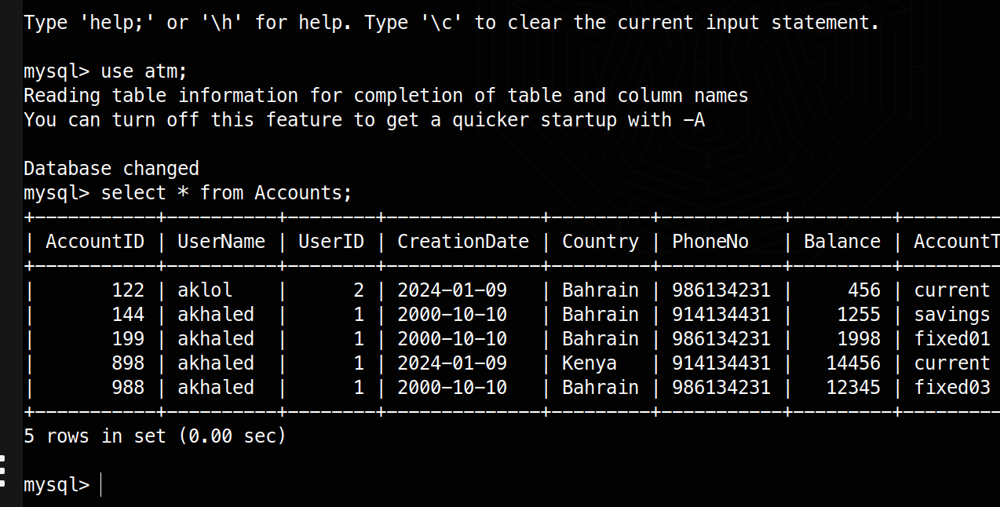
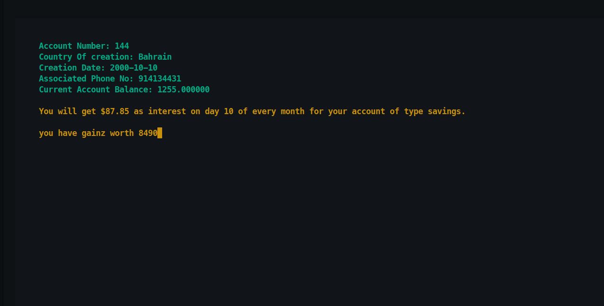

# ATM-SYS

This project is a multicomponent ATM system built in C with a mysql database. The following features are implemented

* Login/Register
* Create a new account
* Check the details of existing accounts
* Update information of existing accounts
* Remove existing accounts
* Check list of owned accounts
* Make transactions

## File System (FS)

```bash
.
├── database
│   └── init.sql
├── Makefile
├── README.md
└── src
├── AccOps.c
├── auth.c
├── header.h
├── main.c
├── system.c
├── TransOps.c
└── utils.c

2 directories, 10 files
```


## Database Information

As said before, this project incorporates a mySQL DB that is used for storage. Here is an Example of one of the tables.

```SQL
CREATE TABLE IF NOT EXISTS `atm`.`Accounts` (
    `AccountID` INT NOT NULL,
    `UserName` VARCHAR(255) NOT NULL,
    `UserID` INT NULL,
    `CreationDate` VARCHAR(255) NOT NULL,
    `Country` VARCHAR(255) NOT NULL,
    `PhoneNo` VARCHAR(255) NOT NULL,
    `Balance` DOUBLE NOT NULL,
    `AccountType` VARCHAR(255) NOT NULL,
    PRIMARY KEY (`AccountID`),
    CONSTRAINT `User-AccountsFK` FOREIGN KEY (`UserName`, `UserID`) REFERENCES `atm`.`Users` (`UserName`, `UserID`) ON DELETE CASCADE ON UPDATE CASCADE
);
```

## Screenshot examples of the project






## Steps to run

1. clone this repo
2. Ensure mysql, and all proper dependencies are installed
3. run `make`
4. run `./atm`

## Done By akhaled01 (Abdulrahman Idrees)
